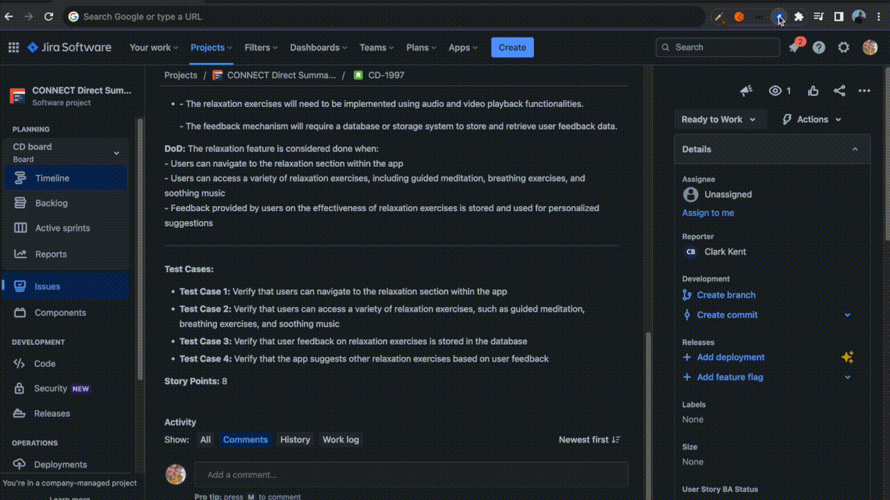
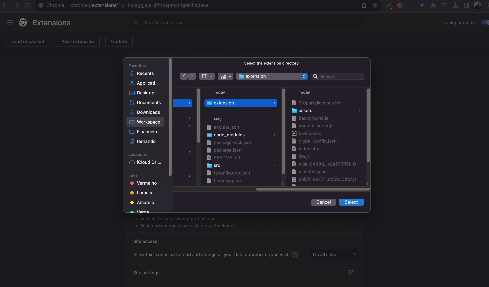

# Scrum Story GPT

This Chrome Extension was created to save you a bunch of time when you are creating your Scrum Stories. It will help on writing the sprint stories in the written format and subtasks in one click.

## How to add Story Descriptions

To start adding story descriptions follow these steps:
1. Click in the description area and make it editable. **Otherwise, it won't work**
2. Open the extension
3. Explain shortly the story that you want to create
4. If you already configured your OpenAI Key, keep selecting the checkbox "Use ChatGPT to enhance it" and it will create a full scrum story based on a scrum template.
5. If you unselect the checkbox, it will add your raw text to the description box.


## Examples of a good description

**What is a good pattern to use: Explain WHAT you want, WHICH steps and Acceptance criteria, WHY you need this story, HOW you will test it and WHAT is the definition of done.**

---------
*Simple example used in the example above*

> "Create a story where the goal is to make me a more relaxed person"

---------

*The more details you give, the better the AI will understand and have more data to create a much better story*

> We need to change the world so we can save the planet. To do that we need to stop wars and create more innovative ways
> of new plants.
> When we are able to have a quality life for all, we accomplish our goal

-------

*This is an example that we consider the best pattern to use. The description below gave enough data so the IA can create really good content for each section of the Scrum Template*

> "We use Elastic Search to search by products at MyCompany inside MyEcommerce ecommerce.
> We need to create a method specifically to filter by Super Deals. When the user clicks on the filter by Super Deals, the API
> should filter and only bring products inside the Super Deals promotions.
> Technically we need to overcome Elastic Search's 10k items per search limitation. This can be done by using
> the aggregation as a hack to overcome this problem.
> 
> The DoD of this story is to be able to see only Super Deals products when we filter by it.
> 
> We need this because the user can't filter by Super Deals promotions."

## Prompt

You can check the prompt that we use in the file `full-prompt-example.html`

## How to add SubTasks with one click

We initialize the extension with the default SubTasks that you can check in the file `global-config.json` and you can change it and personalize to your need in the menu **SubTasks**.



## Configure your Scrum Story GPT

1. First, if you want to use IA to power up your descriptions, go to the menu "ChatGPT" and add your OpenAI Key
2. Go to "SubTasks" menu to configure the default subtasks that you want to create with one click.

## Changing the Description Template

If you have a specific template that you need to follow, you can copy and paste the prompt from `full-prompt-example.html` file and when you finish your changes, convert the prompt to a string on a single line and save it in the file `global-config.json`.

After that, you need to rebuild your application and load the extension again.

## How to add the extension to your chrome

This project was generated with [Angular CLI](https://github.com/angular/angular-cli) version 15.2.6.

1. Clone this repository
2. Install the dependencies with `npm install`
3. Run the following command to create the `extension` folder

```
ng build --output-path extension
```

4. After this, add the unload package in /extension as a chrome extension



## Development server

Run `ng serve` for a dev server. Navigate to `http://localhost:4200/`. The application will automatically reload if you change any of the source files.
